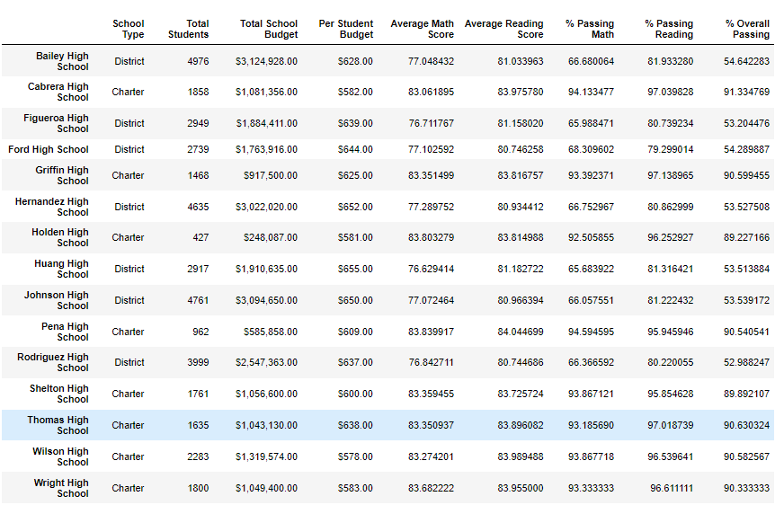

# School_District_Analysis
## Purpose:
Evidence has been found that the grades for reading and math for the 9th grades in Thomas High School have been altered, thus the data analysis of all the schools in the district must be re-assessed to exclude these values. Once the values have been excluded the school district analysis will be re-examined into several sections to examine how test scores fare across **(1) grades, (2) school spending, (3) school size, and (4) school type.** Overall we will take a glance at how the test scores affected the first analysis. 

## Results:
* How is the district summary affected?

**Old School District Summary**

**New School District Summary**

As you can see with the pictures above the percentages have remained stable since excluding the 9th graders from Thomas High School, so there has been little effect to the district school summary.

* How is the school summary affected?

**Old School Summary**

**New School Summary**

The Thomas High School % Passing for Math, Reading, and Overall Passing have all increased by at least 20%. This shows that the excluded data skewed the Thomas High School total perecentages greatly.

* How does replacing the ninth graders’ math and reading scores affect Thomas High School’s performance relative to the other schools?

By replacing the 9th graders' math and reading scores, it brings Thomas High Schools in the top 5 overall performances in the school district.

* How does replacing the ninth-grade scores affect the following:
  * Math and reading scores by grade

**Math Scores**

**Reading Scores**

Excluding the data points did not effect the grade averages by school the rest remained fairly the same.

  * Scores by school spending

The spending did not change in any way, it remained about the same.

  * Scores by school size

Scores based by school size also remained fairly the same.

  * Scores by school type

Scores by school type changed a bit since Thomas High School rose in score stature, so charter schools are outperforming District in the % Passing for Math, Reading and Overall.

## Summary:

The changes that occurred after dropping the 9th graders' scores for math and reading for Thomas High School, did not drastically change the other score summary charts, such as spending, size and by grades, it did however, change scores by school type. The most change was in the overall top five school performers, as Thomas High School moved to the second spot. This means that for the school itself it rose in score stature, but the overall effect it had on the district and school summary analaysis was very minimal, if there were more than one school that need to have values exclude the data set would have changed drastically, but since it was only one school it changed certain outputs, but not all.
